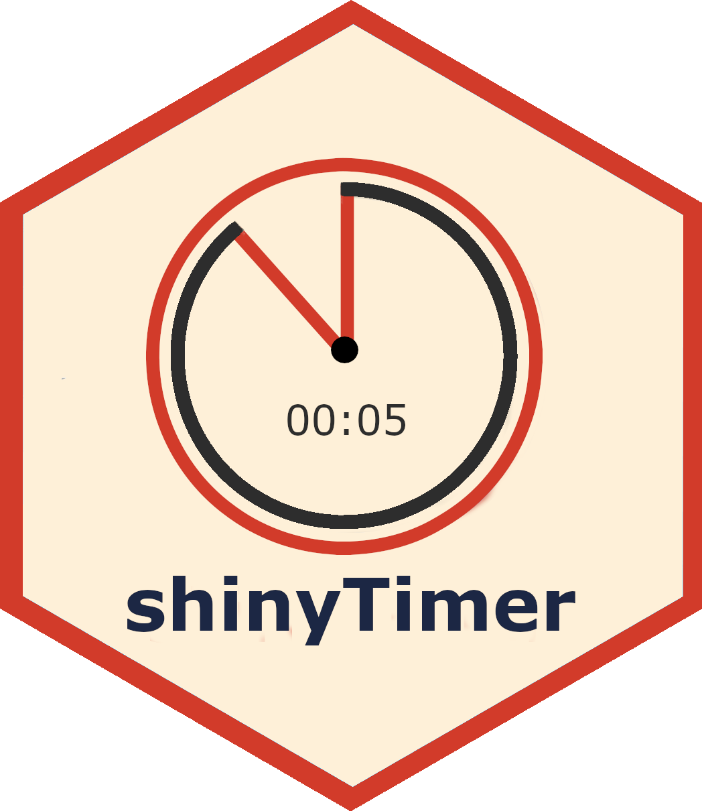

<!-- README.md is generated from README.Rmd. Please edit that file -->

```{r, include = FALSE}
knitr::opts_chunk$set(
  collapse = TRUE,
  comment = "#>"
)
```

# shinyTimer 

<!-- badges: start -->
[](https://github.com/maciekbanas/shinyTimer/actions/workflows/R-CMD-check.yaml)
<!-- badges: end -->

 `shinyTimer` allows you to easily integrate a countdown timer into Shiny UI, providing real-time updates and server notification when the timer completes.
 
 In examples below I make use of [shinyMobile](https://github.com/RinteRface/shinyMobile/) framework.

<div style="text-align: center;">
  
</div>

## Install

Development version:

```
# install.packages("remotes")
remotes::install_github("maciekbanas/shinyTimer")
```

## How it works

To get things work you need two functions: 

- On `UI` side `shinyTimer()` to add a widget.
- On `server` side `countDown()` to trigger counting.

`shinyTimer()` is by default formatted as `simple` one, but you can switch `format` to a `clock`.

<div style="text-align: center;">
  
</div>

You can either set only `seconds`, `minutes` or both.

<div style="text-align: center;">
  
</div>

## When timer completes

Once the timer reaches `0` JavaScript sends `timer_done` value to Shiny `input`.
You can use it to trigger an action (see example below).

```
ui <- shinyMobile::f7Page(
  shinyMobile::f7Card(
    shinyTimer(
      inputId = "shiny_timer",
      seconds = 10L, 
      format = "simple", 
      style = "font-weight: bold; font-size: 72px; text-align:center"
    ),
    shinyMobile::f7Button(
      "start_timer",
      label = "Start", 
      size = "large",
      rounded = TRUE,
      color = "orange"
    ) |>
      htmltools::tagAppendAttributes(
        style="font-size:20px;"
      )
  )
)

server <- function(input, output, session) {
  shiny::observeEvent(input$start_timer, {
    shinyTimer::countDown(session, "shiny_timer")
  })
  shiny::observeEvent(input$timer_done, {
    shinyMobile::f7Dialog(
      id = "dialog",
      title = "Time's Up!",
      text = ""
    )
  })
}

shinyApp(ui, server)
```

<div style="text-align: center;">
  
</div>
