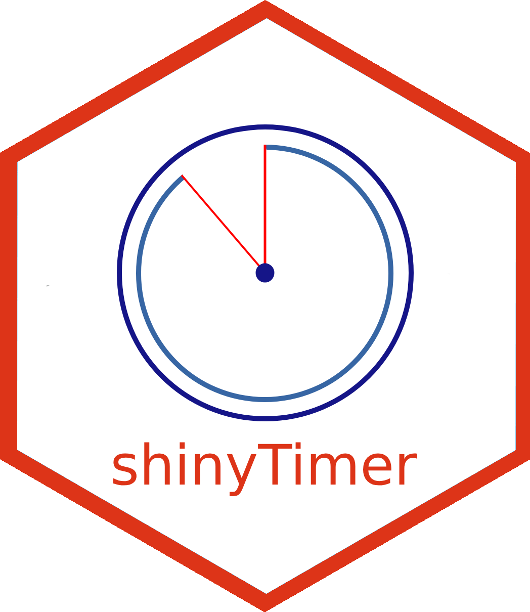
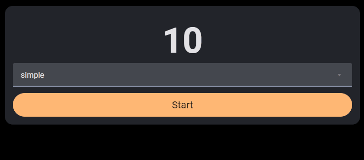
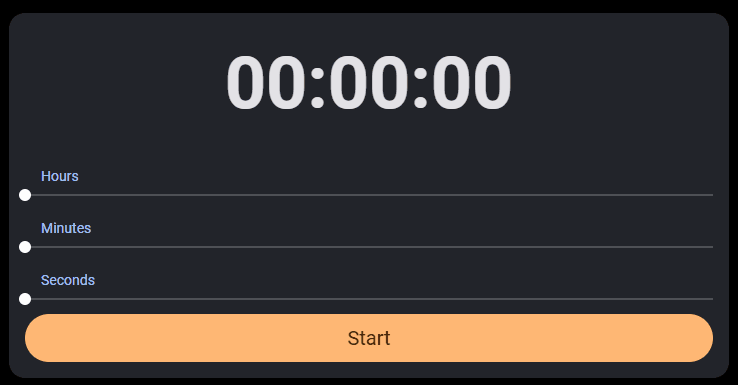
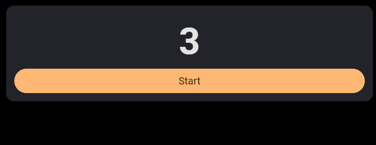
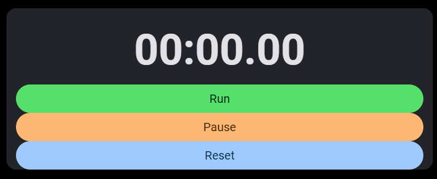

<!-- README.md is generated from README.Rmd. Please edit that file -->

# shinyTimer 

<!-- badges: start -->

<!-- badges: end -->

`shinyTimer` allows you to easily integrate a countdown timer into Shiny
UI, providing real-time updates and server notification when the timer
completes.

In examples below I make use of
[shinyMobile](https://github.com/RinteRface/shinyMobile/) framework.

## Install

Development version:

    # install.packages("remotes")
    remotes::install_github("maciekbanas/shinyTimer")

## How it works

To get things work you need to add in your `UI` `shinyTimer()` and
trigger an action in your `server` (e.g. `countDown()`).

Try it out:

    ui <- shinyMobile::f7Page(
      shinyMobile::f7Card(
        shinyTimer::shinyTimer(
          inputId = "shiny_timer",
          seconds = 10L, 
          type = "simple", 
          style = "font-weight: bold; font-size: 72px; text-align:center"
        )
      )
    )

    server <- function(input, output, session) {
      shiny::observe({
        shinyTimer::countDown(
          inputId = "shiny_timer"
        )
      })
    }

    shinyApp(ui, server)

`shinyTimer()` is by default a `simple` one, but you can switch to clock
types by passing `mm:ss`, `hh:mm:ss` or `mm:ss.cs` (with `centiseconds`)
to `type` parameter.

You can either set `seconds`, `minutes` or `hours`.

## When timer completes

Once the timer reaches `0` JavaScript sends `timer_done` value to Shiny
`input`. You can use it to trigger an action (see example below).

    ui <- shinyMobile::f7Page(
      shinyMobile::f7Card(
        shinyTimer::shinyTimer(
          inputId = "shiny_timer",
          seconds = 10L, 
          type = "simple", 
          style = "font-weight: bold; font-size: 72px; text-align:center"
        ),
        shinyMobile::f7Button(
          "start_timer",
          label = "Start", 
          size = "large",
          rounded = TRUE,
          color = "orange"
        ) |>
          htmltools::tagAppendAttributes(
            style = "font-size:20px;"
          )
      )
    )

    server <- function(input, output, session) {
      shiny::observeEvent(input$start_timer, {
        shinyTimer::countDown("shiny_timer")
      })
      shiny::observeEvent(input$timer_done, {
        shinyMobile::f7Dialog(
          id = "dialog",
          title = "Time's Up!",
          text = ""
        )
      })
    }

    shinyApp(ui, server)

## Stopwatch

You can also use `shinyTimer` as a stopwatch. Simply trigger
`shinyTimer` in your `server` with `countUp()`. You can also
`pauseTimer()` and `resetTimer()`.

    ui <- shinyMobile::f7Page(
      shinyMobile::f7Card(
        shinyTimer::shinyTimer(
          inputId = "shiny_timer",
          seconds = 0L, 
          type = "mm:ss.cs", 
          style = "font-weight: bold; font-size: 72px; text-align:center"
        ),
        shiny::br(),
        shinyMobile::f7Block(
          shinyMobile::f7Button(
            "start_timer",
            label = "Run", 
            size = "large",
            rounded = TRUE,
            color = "green"
          ) |>
            htmltools::tagAppendAttributes(
              style = "font-size:20px;"
            ),
          shinyMobile::f7Button(
            "pause_timer",
            label = "Pause", 
            size = "large",
            rounded = TRUE,
            color = "orange"
          ) |>
            htmltools::tagAppendAttributes(
              style = "font-size:20px;"
            ),
          shinyMobile::f7Button(
            "resume_timer",
            label = "Reset", 
            size = "large",
            rounded = TRUE,
            color = "blue"
          ) |>
            htmltools::tagAppendAttributes(
              style = "font-size:20px;"
            )
        )
      )
    )

    server <- function(input, output, session) {
      shiny::observeEvent(input$start_timer, {
        shinyTimer::countUp("shiny_timer")
      })
      shiny::observeEvent(input$pause_timer, {
        shinyTimer::pauseTimer("shiny_timer")
      })
      shiny::observeEvent(input$resume_timer, {
        shinyTimer::resetTimer("shiny_timer")
      })
    }

    shinyApp(ui, server)
